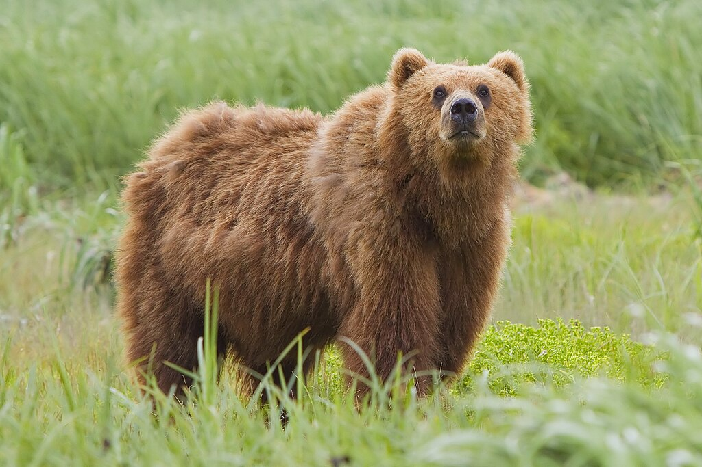
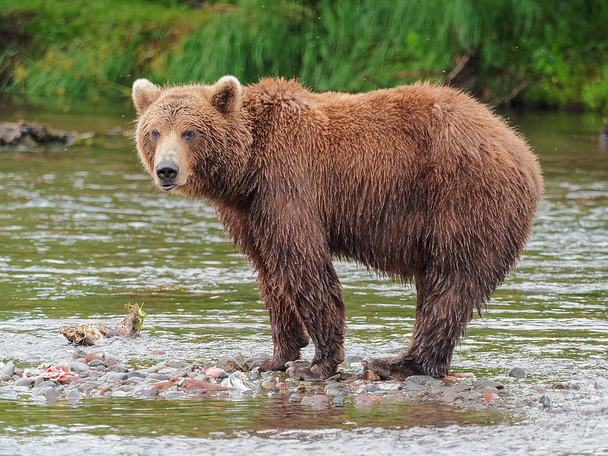

# PS-BEAR

A preprint version of a paper on PS-BEAR is available [here](http://dx.doi.org/10.13140/RG.2.2.13956.54409). For the code of a specific version of PS-BEAR, check the specific branch. The application is live [here](https://psbear.streamlit.app/).

**Note:** Default copyright laws apply, meaning that the repository owner retains all rights to the source code and no one may reproduce, distribute, or create derivative works from this work.

## Acknowledgement

If you refer to this software or work in an academic publication, please cite as below:

```
@unpublished{bajpai2024psbear,
   author={Bajpai, Shubham},
   title={Automated approaches for solving physics problems},
   doi={10.1109/LRA.2023.3270034},
   year=2024
}
```

## A few images of bears

### Giant Panda (Ailuropoda Melanoleuca) - Estimated Population: 500 to 1,000


### Kodiak Bear (Ursus Arctos Middendorffi) - Estimated Population: 3,500



### Red Panda (Ailurus Fulgens) - Estimated Population: 10,000


### Kamchatka Brown Bear (Ursus Arctos Beringianus) - Estimated Population: 8,000 to 14,000


### Polar Bear (Ursus Maritimus) - Estimated Population: 22,000 to 31,000


### Eurasian Brown Bear (Ursus Arctos Arctos) - Estimated Population: 100,000


### American Black Bear (Ursus Americanus) - Estimated Population: 600,000 to 900,000


## Planned Architecture of PS-BEAR (OCR is abbreviation for Optical Character Recognition)

